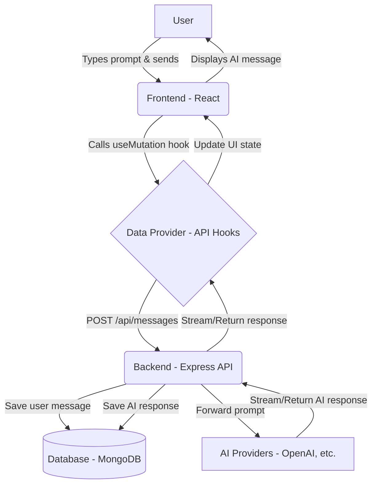

# LibreChat Architecture & Development Guide

This guide provides a comprehensive overview of the LibreChat codebase, how data flows through the application, and standard procedures for adding or removing features.

## 1. Codebase Overview

LibreChat is a full-stack monorepo application designed to provide a unified chat interface for various AI models. 
- **Frontend (`client/`)**: Built using React. It manages the user interface, conversation state, and interactions.
- **Backend (`api/`)**: Built using Node.js and Express. It serves as the API gateway, handles authentication, communicates with the database, and orchestrates requests to various external AI providers (OpenAI, Anthropic, Google, etc.).
- **Shared Packages (`packages/`)**: Contains shared types, data schemas, and the data-provider package (which wraps API calls and React Query hooks for the frontend).

---

## 2. Application Flow Diagram

Below is a visual representation of how a user's prompt travels through the LibreChat system:

---

## 3. Adding New Features (Finding Data Points)

If you have a customized use case and want to introduce new features, you will need to touch different parts of the stack. Here is where you should look:

### Backend (Node.js/Express)
- **`api/models/`**: This is where database schemas (Mongoose models) are defined. If your feature requires storing new data points (e.g., custom user preferences, new conversation tags), start by modifying or adding a schema here.
- **`api/server/routes/`**: Define your new API endpoints here. This connects the HTTP requests from the frontend to the controller functions.
- **`api/server/controllers/`**: The logic that immediately handles an incoming request. It validates the request and passes data to the services.
- **`api/server/services/`**: The core business logic resides here. If you are integrating a new internal tool, a custom AI model, or complex data processing, build it into a service file.

### Frontend (React)
- **`packages/data-provider/`**: Before building the UI, define your API calls here. This package uses React Query and Axios to manage API requests and state hydration. Add your endpoints and hooks here to keep data fetching centralized.
- **`client/src/components/`**: Build your new user interface components here. The UI is built with a modular approach, so Try locating existing components that match what you're trying to build and follow their patterns.
- **`client/src/routes/`**: If your feature requires an entirely new page or view, you'll register the route here.
- **`client/src/store/`**: If your feature relies on complex global state (like UI toggles or shared application context), look into the state management setup (often utilizing Recoil or Zustand).

---

## 4. Steps for Removing Features

Safely removing a feature from a full-stack codebase requires ensuring you clean up both the client and the server without leaving dead code or broken dependencies. Follow these steps:

### Step 1: Remove Frontend UI & Entry Points
1. Find and delete the specific React components in `client/src/components/` related to the feature.
2. Remove any routes in `client/src/routes/` that direct to those components.
3. Remove references to the feature from navigation bars, sidebars, or menus.

### Step 2: Clean Up Data Fetching
1. Go to `packages/data-provider/` and remove the Axios API calls and React Query hooks that were fetching data for the removed feature.
2. Remove any exported types or schemas in `packages/data-schemas/` that are no longer used.

### Step 3: Remove Backend Logic
1. Delete the corresponding routes in `api/server/routes/`.
2. Delete the associated controller functions in `api/server/controllers/`.
3. Remove the core business logic from `api/server/services/`.
4. Run a project-wide search (e.g., using `grep` or your IDE's search tool) for the filenames or function names to ensure nothing else was depending on them.

### Step 4: Clean Up Database Models (Optional but Recommended)
1. If the feature had its own dedicated database collection, remove the schema from `api/models/`.
2. *Note:* If you are operating in production, do not drop the database collection immediately unless you are sure the historical data is no longer needed. Usually, just removing the application code is sufficient for the first deployment.

### Step 5: Verification
1. Run `npm run build` or `npm run build:packages` to ensure there are no compilation errors.
2. Run `npm run lint` to find any leftover unused imports.
3. Start the application locally and verify that the app builds and runs without erroring on boot.
