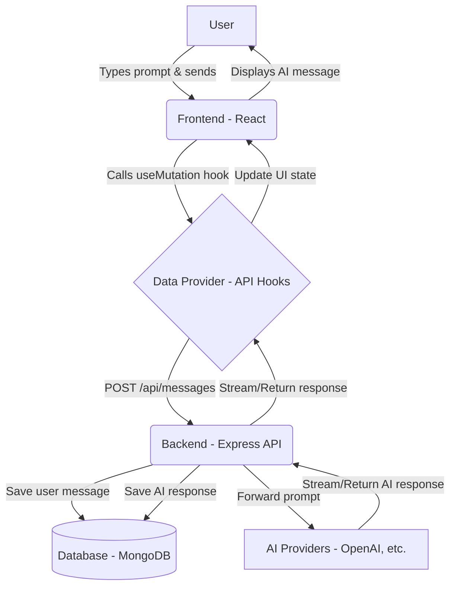

# LibreChat Architecture & Development Guide

This guide provides a comprehensive overview of the LibreChat codebase, how data flows through the application, and standard procedures for adding or removing features.

## 1. Codebase Overview

LibreChat is a full-stack monorepo application designed to provide a unified chat interface for various AI models. 
- **Frontend (`client/`)**: Built using React. It manages the user interface, conversation state, and interactions.
- **Backend (`api/`)**: Built using Node.js and Express. It serves as the API gateway, handles authentication, communicates with the database, and orchestrates requests to various external AI providers (OpenAI, Anthropic, Google, etc.).
- **Shared Packages (`packages/`)**: Contains shared types, data schemas, and the data-provider package (which wraps API calls and React Query hooks for the frontend).

---

## 2. Application Flow Diagram

Below is a visual representation of how a user's prompt travels through the LibreChat system:

---

## 3. Adding New Features (Finding Data Points)

If you have a customized use case and want to introduce new features, you will need to touch different parts of the stack. Here is where you should look:

### Backend (Node.js/Express)
- **`api/models/`**: This is where database schemas (Mongoose models) are defined. If your feature requires storing new data points (e.g., custom user preferences, new conversation tags), start by modifying or adding a schema here.
- **`api/server/routes/`**: Define your new API endpoints here. This connects the HTTP requests from the frontend to the controller functions.
- **`api/server/controllers/`**: The logic that immediately handles an incoming request. It validates the request and passes data to the services.
- **`api/server/services/`**: The core business logic resides here. If you are integrating a new internal tool, a custom AI model, or complex data processing, build it into a service file.

### Frontend (React)
- **`packages/data-provider/`**: Before building the UI, define your API calls here. This package uses React Query and Axios to manage API requests and state hydration. Add your endpoints and hooks here to keep data fetching centralized.
- **`client/src/components/`**: Build your new user interface components here. The UI is built with a modular approach, so Try locating existing components that match what you're trying to build and follow their patterns.
- **`client/src/routes/`**: If your feature requires an entirely new page or view, you'll register the route here.
- **`client/src/store/`**: If your feature relies on complex global state (like UI toggles or shared application context), look into the state management setup (often utilizing Recoil or Zustand).

---

## 4. Steps for Removing Features

Safely removing a feature from a full-stack codebase requires ensuring you clean up both the client and the server without leaving dead code or broken dependencies. Follow these steps:

### Step 1: Remove Frontend UI & Entry Points
1. Find and delete the specific React components in `client/src/components/` related to the feature.
2. Remove any routes in `client/src/routes/` that direct to those components.
3. Remove references to the feature from navigation bars, sidebars, or menus.

### Step 2: Clean Up Data Fetching
1. Go to `packages/data-provider/` and remove the Axios API calls and React Query hooks that were fetching data for the removed feature.
2. Remove any exported types or schemas in `packages/data-schemas/` that are no longer used.

### Step 3: Remove Backend Logic
1. Delete the corresponding routes in `api/server/routes/`.
2. Delete the associated controller functions in `api/server/controllers/`.
3. Remove the core business logic from `api/server/services/`.
4. Run a project-wide search (e.g., using `grep` or your IDE's search tool) for the filenames or function names to ensure nothing else was depending on them.

### Step 4: Clean Up Database Models (Optional but Recommended)
1. If the feature had its own dedicated database collection, remove the schema from `api/models/`.
2. *Note:* If you are operating in production, do not drop the database collection immediately unless you are sure the historical data is no longer needed. Usually, just removing the application code is sufficient for the first deployment.

### Step 5: Verification
1. Run `npm run build` or `npm run build:packages` to ensure there are no compilation errors.
2. Run `npm run lint` to find any leftover unused imports.
3. Start the application locally and verify that the app builds and runs without erroring on boot.

---

## 5. Configuration & Deployment Architecture

Understanding how the various configuration files interact is essential for deploying and customizing LibreChat:

1.  **`Dockerfile` / `Dockerfile.multi`**: The blueprint that packages the `api` (backend) and `client` (frontend) source code into a runnable container. It defines the operating system and dependencies but contains no sensitive data.
2.  **`docker-compose.yml`**: The orchestrator that spins up the LibreChat container alongside required services like MongoDB (for data storage) and Meilisearch (for fast conversation indexing). It maps volumes and networks them together.
3.  **`.env`**: The environment injector. `docker-compose.yml` reads this file and passes the variables into the running LibreChat container. This is where you store sensitive API keys, LDAP credentials, and JWT secrets.
4.  **`librechat.yaml`**: The feature configurator. This file dynamically controls the UI and behavior (like defining custom AI Endpoints, setting file upload limits, and UI toggles) without requiring a container rebuild.

---

## 6. The Memory Layer

LibreChat's "Memory" layer is built on **MongoDB**:

1.  **Core Storage:** All prompts, responses, conversation branches, presets, and customized user settings are permanently stored in the `LibreChat` database within the MongoDB container.
2.  **Data Structure:** The schemas defining these memory objects (like `Message` or `Conversation`) are located in `api/models/`.
3.  **Search Layer:** To quickly retrieve past memories and messages, the text data is mirrored to **Meilisearch**, a secondary database service running alongside MongoDB that provides instant, typo-tolerant search capabilities.

---

## 7. Context Window & Token Management

Sending the entire history of a long conversation to an AI provider every time would rapidly consume tokens and hit the model's limits. LibreChat prevents this through a smart pruning and summarization system (handled primarily in `api/app/clients/BaseClient.js`):

### 1. The Token Context Limit
Every AI model configured in LibreChat has a defined `maxContextTokens` limit. Before making a request, LibreChat counts the exact number of tokens for every single message in the chat history.

### 2. "First In, First Out" Truncation
When a user sends a new message in a long conversation, LibreChat works backwards. It adds the **newest** messages first to an invisible "Context Payload" bucket until the payload reaches the `maxContextTokens` threshold. Any messages older than that limit are **pruned** (dropped from the API payload sent to the AI provider) to save tokens. They remain intact in the MongoDB history for the user to view.

### 3. Auto-Summarization
To ensure the AI doesn't lose the overarching context when older messages are pruned, LibreChat can automatically run a **Summary generation**. It takes the dropped older messages, uses a cheaper and faster model (like `gpt-4o-mini` or `claude-3-haiku`) to write a terse summary of the distant past, and injects that summary as a "System Prompt" instruction at the top of the payload.

The resulting API payload structure looks like this:
1. **[System]**: "Summary of the distant past: [Generated Summary]" *(Very cheap tokens)*
2. **[User]**: Recent Message
3. **[AI]**: Recent Response
4. **[User]**: *Latest prompt*

---

## 8. Why do the RAG API and Meilisearch exist in Docker?

If MongoDB handles all the chat history and the backend manages the token truncation limits, you might wonder why `rag_api` and `meilisearch` are included in the `docker-compose.yml`.

### Meilisearch (Conversation Search)
While MongoDB is great for rigidly storing and retrieving exact matches of data (like loading a specific conversation ID), it is notoriously slow/inefficient at **fuzzy full-text search**.
- When a user types a half-remembered phrase into the search bar (e.g. "econnect login issues payload"), they are searching across thousands of past messages.
- **Meilisearch** is an ultra-fast, typo-tolerant search engine specifically designed for this. MongoDB sends a copy of the message text to Meilisearch in the background. When the user searches, LibreChat asks Meilisearch to find the message instantly, rather than forcing MongoDB to slowly scan every document.

### The RAG API (Retrieval-Augmented Generation & File Chat)
The Node.js backend (`api/`) is excellent at handling chat streams and database logic, but Node.js is not the best ecosystem for heavy mathematical text-processing, vector math, and file parsing.
- The **RAG API** is a separate microservice written in **Python**.
- When an employee uploads a massive 100-page PDF or a Word document into the chat and asks the AI a question about it, it would blow past the `maxContextTokens` immediately if sent raw.
- Instead, the file is sent to the **RAG API**. The Python service parses the PDF, turns the text into mathematical "embeddings" (vectors), and stores them in a highly optimized vector database (like pgvector). 
- When the user asks a question about the PDF, LibreChat asks the RAG API to find only the 3 or 4 paragraphs most relevant to the question, and injects *only those paragraphs* into the prompt payload. This allows users to "Chat with Files" without burning millions of tokens.
